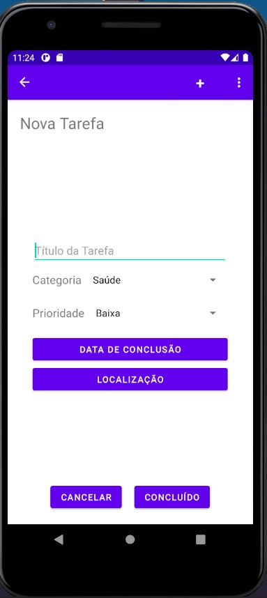
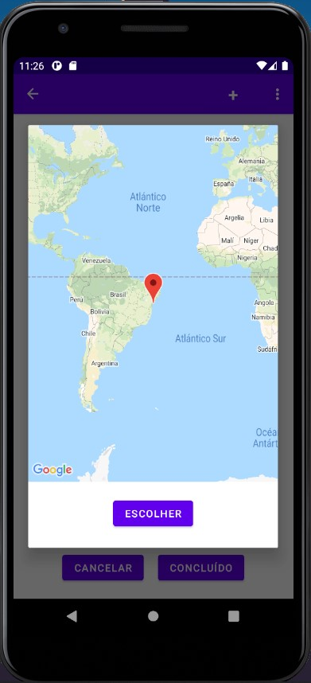
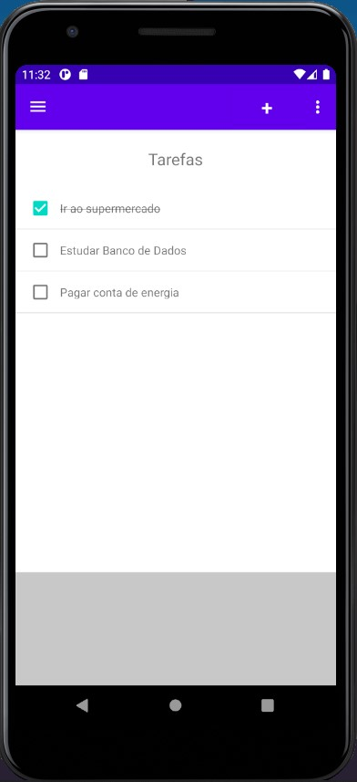
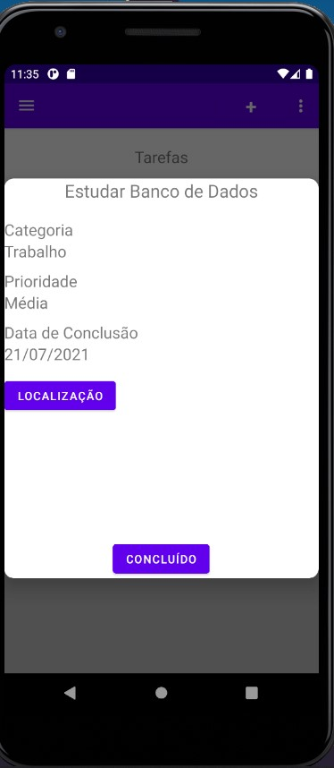

<h1 align=center> ToDoList Mobile </h1>

 O aplicativo ToDoList visa contribuir
com a organização pessoal de quem o utiliza! De uma
maneira prática e rápida, em poucos minutos, é possível
organizar seu dia ou semana com as tarefas mais importantes
para você se preocupar menos e executar mais!

<h3> Story Board </h3>

<h3> Lista de Requisitos </h3>

<h3> Mapa Conceitual </h3>

<h3> Diagrama de Classes </h3>

<h3> Casos de Uso </h3>

<h3> Diagrama de Atividades </h3>

<h3> Protótipo de Baixa Fidelidade </h3>

<h3> Protótipo de Alta Fidelidade </h3>

<h3> Aplicativos Correlatos </h3>

Downloads: + 10 milhões na PlayStore

Avaliações: Até o momento, 174mil, c/ 4,6 de nota

Downloads: + 10 milhões na PlayStore

Avaliações: Até o momento, 227mil, c/ 4,5 de nota

Downloads: + 10 milhões na PlayStore

Avaliações: Até o momento, 384mil, c/ 4,5 de nota

Downloads: + 1 bilhão na PlayStore

Avaliações: Até o momento, mais de 1 milhão, c/ 4,3 de nota

<h3> Conceitos utilizados no projeto </h3>
<table>
<thead>
<tr><td>Nivelamento</td><td>Status</td></tr>
</thead>
<tbody>
<tr>
 <td>Preferências</td>
 <td>OK</td>
</tr>
<tr>
 <td>Permissão</td>
 <td>OK</td>
</tr>
<tr>
 <td>Internacionalização</td>
 <td>OK</td>
</tr>
<tr>
 <td>Persistência em SQLite</td>
 <td>OK</td>
</tr>
<tr>
 <td>Google Analytic</td>
 <td>OK</td>
</tr>
<tr>
 <td>Comunicação com Servidor (JSON)</td>
 <td>Pendente</td>
</tr>
</tbody>
</table>